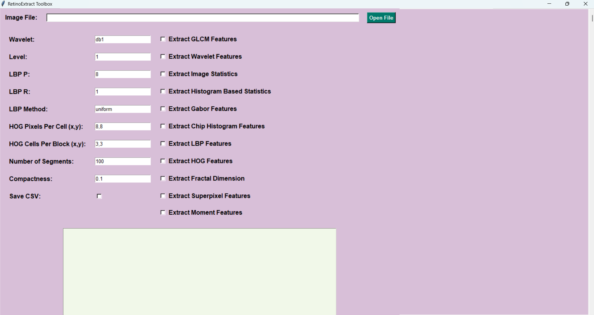

**RetinoExtract Toolbox**

**Overview**
RetinoExtract is an open-source Python toolbox for automated feature extraction from retinal fundus images. It supports both a Graphical User Interface (GUI) and Command Line Interface (CLI), making it accessible for users with varying technical expertise.

**Key features:**
1. GUI support: Load images, select feature types, configure parameters, and extract features with a few clicks. Results can be saved as CSV.
2. CLI interface: Automate batch feature extraction with full control over options and parameters.

**Supported Feature Extractors**
The toolbox supports the following:
1. Feature Extraction:
    Texture (GLCM, GLRLM, LBP)
    Intensity and Histogram
    Wavelet Decomposition
    Shape (Hu Moments, Zernike Moments)
    Edge Detection, Histogram of Oriented Gradients (HOG)
    Fractal Dimensions
    Gabor Filters
    Superpixel Analysis
2. Customizable Parameters for each feature type.
3. Save Results: Export extracted feature values as CSV files.

Make sure to include the main options while using dependent parameters. Otherwise, the toolbox will raise an error.
**Installation**

1. Clone the repository:
  
   git clone https://github.com/yourusername/RetinoExtractToolbox.git
   
2. Navigate to the directory:
  
   cd RetinoExtractToolbox
  
3. Install required dependencies:
 
   pip install r requirements.txt

**Usage:**

**Graphical User Interface (GUI)**
1. Run the toolbox:
   
                python gui.py
   
2. Steps:
        A. Load Image: Use the "Load Image" button to select a fundus image.
        B. Select Features: Choose the feature type (e.g., GLCM, LBP).
        C. Set Parameters: Configure feature specific parameters.
        D. Extract Features: Click "Extract Features" to display the extracted values.
        E. Save CSV (optional): Check the "Save CSV" option to save the results to a file.

3. Screenshot:
   

**Command Line Interface (CLI)**
1. Run the toolbox using the CLI to automate feature extraction.

                python main.py [OPTIONS] image_path
   
2.Example Command
An exmaple command to extract GLCM and LBP features from an image and save the results to a specific directory is given below:

            python main.py glcm lbp_P 8 lbp_R 1 output_dir results/ path/to/image.jpg
   
3. Available Options

Option                        Description                                          Example
--------------------------------------------------------------------------------------------------------
--glcm                       Extract GLCM (Gray Level Co-occurrence Matrix)       --glcm
--glrlm                      Extract GLRLM (Gray Level Run Length Matrix)         --glrlm
--wavelet                    Extract Wavelet decomposition based features         --wavelet
--wavelet_type WAVELET_TYPE  Specify wavelet type for wavelet decomposition       --wavelet_type db1
--level LEVEL                Set the wavelet decomposition level                 --level 3
--lbp                        Extract LBP (Local Binary Pattern) features          --lbp
--lbp_P LBP_P                Number of circular points for Local Binary Patterns  --lbp_P 8
--lbp_R LBP_R                Radius of the circle for LBP                        --lbp_R 1
--lbp_method LBP_METHOD      Method for calculating LBP                          --lbp_method uniform
--hog                        Extract HOG (Histogram of Oriented Gradients)       --hog
--hog_pixels_per_cell        Pixels per cell for HOG                             --hog_pixels_per_cell 8 8
--hog_cells_per_block        Cells per block for HOG feature extraction          --hog_cells_per_block 2 2
--superpixel                 Superpixel segmentation based features              --superpixel
--n_segments N_SEGMENTS      Number of superpixels for segmentation              --n_segments 100
--compactness COMPACTNESS    Compactness parameter for superpixel segmentation   --compactness 10
--radius RADIUS              Radius for circular feature extraction              --radius 5
--output_dir OUTPUT_DIR      Specify the directory for saving output files       --output_dir results/
--image_stats                Extract basic image statistics (e.g., mean, variance)--image_stats
--histogram                  Extract histogram-based features                    --histogram
--gabor                      Apply Gabor filter for texture analysis             --gabor
--chip_histogram             Extract histogram features for image chips          --chip_histogram
--fractal                    Extract fractal-based features                      --fractal
--moments                    Extract statistical moments of the image            --moments
--hu_moments                 Extract Hu moments for shape analysis               --hu_moments
--zernike                    Extract Zernike moments for shape and pattern       --zernike

**Dependency Rules**

Some options require a parent option to be activated. The following pairs must be used together:

            --wavelet_type` requires `--wavelet` to be enabled.
            --level` requires `--wavelet` to be enabled.
            --lbp_P` requires `--lbp` to be enabled.
            --lbp_R` requires `--lbp` to be enabled.
            --lbp_method` requires `--lbp` to be enabled.
            --hog_pixels_per_cell` requires `--hog` to be enabled.
            --hog_cells_per_block` requires `--hog` to be enabled.
            --n_segments` requires `--superpixel` to be enabled.
            --compactness` requires `--superpixel` to be enabled.
            --radius` requires `--superpixel` to be enabled.

**Valid Option Values**
        --wavelet_type: Valid options include haar, db1, sym2, coif1, etc.
        --lbp_method: Valid options include uniform, default, ror, var.
        --hog_pixels_per_cell: Provide values like 8 8, 16 16.
        --hog_cells_per_block: Provide values like 2 2, 4 4.
        --compactness: Any positive integer value.
        --n_segments: Any positive integer value.

**Error Handling**
If required arguments are missing, the toolbox will display usage instructions:
text
usage: main.py [h] [wavelet_type WAVELET_TYPE] [level LEVEL] ... image_path
main.py: error: the following arguments are required: image_path

Examples
1. Extract All Features (CLI):
   
   python main.py glcm lbp wavelet output_dir output/ image.jpg
   

2. Save Results as CSV (GUI):
    Check the "Save CSV" option in the GUI.
    Click "Extract Features" to save the feature values.

**Example Data**
We recommend using publicly available fundus datasets such as:

1. DRIVE
2. Orriga
3. REFUGE
4. Dirshti
5. Rim-One

**Reference**
If you use this toolbox for research or projects, please cite:  
text
Your Name et al. (2025). "RetinoExtract Toolbox: A Feature Extraction Tool for Fundus Images."

**Contributing**
See CONTRIBUTING.md for guidelines.

**License**
Distributed under the terms of the MIT license. See LICENSE for details.
